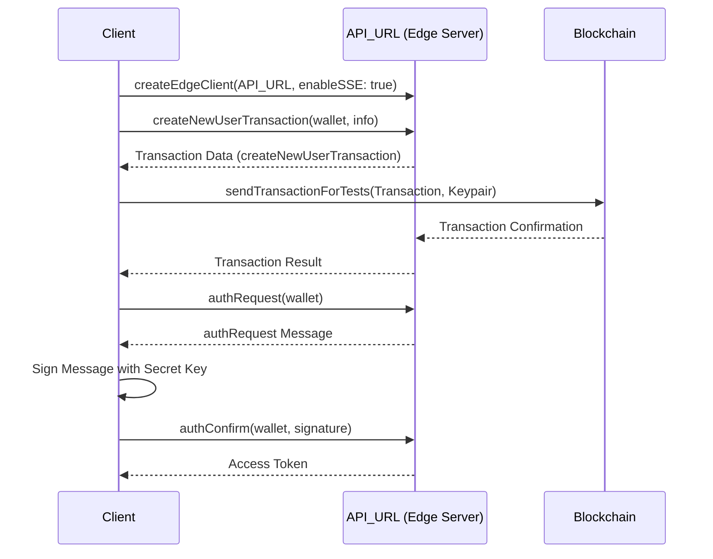

================================================
FILE: 01_createProject/README.md
================================================
### 1 Preparation

#### 1 Generate a keypair

```
solana-keygen new --outfile keys/admin.json --no-bip39-passphrase --force
```

if you want to know the address

```
solana address -k keys/admin.json
```

#### 2 Airdrop

```
solana airdrop 100 --url https://rpc.test.honeycombprotocol.com/ -k keys/admin.json
```

#### 3 Check in the explorer

https://explorer.solana.com/

custom url rpc is here  
https://rpc.test.honeycombprotocol.com

#

### 2 Execute the transaction

#### 1 set API_URL

const API_URL = "https://edge.test.honeycombprotocol.com/"

#### 2 get a keypair from the file

1)fs  
2)path.json  
3)\* as web3 from "@solana/web3.js"  
4)web3.Keypair.fromSecretKey

#### 3 create a client

const client = createEdgeClient<true>(API_URL, true);  
createEdgeClient from @Honeycomb-protocol/edge-client

#### 4 create a Transaction

createCreateProjectTransaction

1)name  
2)authority  
3)payer

#### 5 sendTransactionForTests

1 from "@honeycomb-protocol/edge-client/client/helpers"  
2 arguments  
1)client  
2)Transaction( { blockhash, lastValidBlockHeight, transaction )  
3)signers?: Keypair[]


================================================
FILE: 01_createProject/createProject.ts
================================================
import * as web3 from "@solana/web3.js";
import fs from "fs";
import path from "path";
import { createEdgeClient } from "@honeycomb-protocol/edge-client";
import { sendTransactionForTests } from "@honeycomb-protocol/edge-client/client/helpers";

const API_URL = "https://edge.test.honeycombprotocol.com/";

const walletFile = JSON.parse(
  fs.readFileSync(path.join("./keys/admin.json"), "utf8")
);

const keyPair = web3.Keypair.fromSecretKey(new Uint8Array(walletFile));

const client = createEdgeClient(API_URL, true);

const {
  createCreateProjectTransaction: { project: projectAddress, tx: txResponse },
} = await client.createCreateProjectTransaction({
  name: "53w",
  authority: keyPair.publicKey.toString(),
  payer: keyPair.publicKey.toString(),
});

const result = await sendTransactionForTests(
  client,
  {
    blockhash: txResponse.blockhash,
    lastValidBlockHeight: txResponse.lastValidBlockHeight,
    transaction: txResponse.transaction,
  },
  [keyPair]
);

console.log(result.signature);


================================================
FILE: 01_createProject/package.json
================================================
{
  "name": "honeycomb",
  "version": "1.0.0",
  "description": "",
  "main": "index.js",
  "scripts": {
    "test": "echo \"Error: no test specified\" && exit 1"
  },
  "keywords": [],
  "author": "",
  "license": "ISC",
  "dependencies": {
    "@honeycomb-protocol/edge-client": "^0.0.7-beta.7",
    "@solana/web3.js": "^1.95.8",
    "esrun": "^3.2.26"
  }
}


================================================
FILE: 02_createUser/README.md
================================================
### 1 Preparation

#### 1 Generate a keypair

```
solana-keygen new --outfile keys/admin.json --no-bip39-passphrase --force
solana-keygen new --outfile keys/user.json --no-bip39-passphrase --force
```

if you want to know the address

```
solana address -k keys/admin.json
```

#### 2 Airdrop

```
solana airdrop 100 --url https://rpc.test.honeycombprotocol.com/ -k keys/admin.json

solana airdrop 100 --url https://rpc.test.honeycombprotocol.com/ -k keys/user.json
```

#### 3 Check in the explorer

https://explorer.solana.com/

custom url rpc is here  
https://rpc.test.honeycombprotocol.com

#

### 2 Execute the transaction

#### 1 set API_URL

const API_URL = "https://edge.test.honeycombprotocol.com/"

#### 2 get a keypair from the file

1)fs  
2)path.json  
3)\* as web3 from "@solana/web3.js"  
4)web3.Keypair.fromSecretKey

#### 3 create a client

const client = createEdgeClient<true>(API_URL, true);  
createEdgeClient from @Honeycomb-protocol/edge-client

#### 4 create a Transaction

createNewUserTransaction

1 wallet  
2 info  
1)name  
2)pfp
https://lh3.googleusercontent.com/-Jsm7S8BHy4nOzrw2f5AryUgp9Fym2buUOkkxgNplGCddTkiKBXPLRytTMXBXwGcHuRr06EvJStmkHj-9JeTfmHsnT0prHg5Mhg
3)bio
3 payer

#### 5 sendTransactionForTests

1 from "@honeycomb-protocol/edge-client/client/helpers"  
2 arguments  
1)client  
2)Transaction( { blockhash, lastValidBlockHeight, transaction )  
3)signers?: Keypair[]

### 6 findUsers

wallets: [userKeyPair.publicKey.toString()]


================================================
FILE: 02_createUser/createUser.ts
================================================
import * as web3 from "@solana/web3.js";
import fs from "fs";
import path from "path";
import { createEdgeClient } from "@honeycomb-protocol/edge-client";
import { sendTransactionForTests } from "@honeycomb-protocol/edge-client/client/helpers";

const API_URL = "https://edge.test.honeycombprotocol.com/";

const adminWalletFile = JSON.parse(
  fs.readFileSync(path.join("./keys/admin.json"), "utf8")
);

const userWalletFile = JSON.parse(
  fs.readFileSync(path.join("./keys/user.json"), "utf8")
);

const adminKeyPair = web3.Keypair.fromSecretKey(
  new Uint8Array(adminWalletFile)
);

const userKeyPair = web3.Keypair.fromSecretKey(new Uint8Array(userWalletFile));

const client = createEdgeClient(API_URL, true);

const {
  createNewUserTransaction: txResponse, // This is the transaction response, you'll need to sign and send this transaction
} = await client.createNewUserTransaction({
  wallet: userKeyPair.publicKey.toString(), // User's wallet public key
  info: {
    name: "Test User",
    pfp: "https://lh3.googleusercontent.com/-Jsm7S8BHy4nOzrw2f5AryUgp9Fym2buUOkkxgNplGCddTkiKBXPLRytTMXBXwGcHuRr06EvJStmkHj-9JeTfmHsnT0prHg5Mhg",
    bio: "This is a test user",
  },
  payer: adminKeyPair.publicKey.toString(), // Optional, the transaction payer's public key
});

const result = await sendTransactionForTests(client, txResponse, [
  adminKeyPair,
]);

console.log(result.signature);

const usersArray = await client.findUsers({
  wallets: ["BPia4pVpHXGp6aBDaAdXyy5h1ArJ64PF8xE6bHT7TWRK"], // String array of users' wallet addresses
});

console.log(usersArray);


================================================
FILE: 02_createUser/keys/admin.json
================================================
[44,252,29,72,148,88,123,173,87,28,240,202,79,182,132,240,143,60,170,227,1,82,40,185,194,99,116,103,74,54,14,83,79,120,169,36,86,51,102,75,193,254,0,235,149,253,109,95,187,172,82,1,227,61,198,177,95,111,73,197,149,92,153,26]


================================================
FILE: 02_createUser/keys/user.json
================================================
[124,137,147,1,159,156,154,133,120,219,133,244,159,153,67,193,135,20,205,142,182,101,1,216,153,160,33,81,53,138,132,52,154,102,166,136,222,44,242,247,163,146,22,191,54,220,250,187,173,148,244,111,23,234,25,50,153,158,218,224,183,129,255,70]


================================================
FILE: 03_authenticate/README.md
================================================


### 1 Preparation

#### 1 Generate a keypair

```

solana-keygen new --outfile keys/user.json --no-bip39-passphrase --force

```

if you want to know the address

```

solana address -k keys/admin.json

```

#### 2 Airdrop

```

solana airdrop 10 --url https://rpc.test.honeycombprotocol.com/ -k keys/user.json

```

#### 3 Check in the explorer

https://explorer.solana.com/

custom url rpc is here  
https://rpc.test.honeycombprotocol.com

#

### 2 Execute the transaction

#### 1 set API_URL

const API_URL = "https://edge.test.honeycombprotocol.com/"

#### 2 get a keypair from the file

1)fs  
2)path.json  
3)\* as web3 from "@solana/web3.js"  
4)web3.Keypair.fromSecretKey

#### 3 create a client

const client = createEdgeClient<true>(API_URL, true);  
createEdgeClient from @honeycomb-protocol/edge-client

#### 4 create a Transaction

createNewUserTransaction

1 wallet  
2 info  
1)name  
2)pfp

`https://lh3.googleusercontent.com/-Jsm7S8BHy4nOzrw2f5AryUgp9Fym2buUOkkxgNplGCddTkiKBXPLRytTMXBXwGcHuRr06EvJStmkHj-9JeTfmHsnT0prHg5Mhg`

3)bio  
3 payer

#### 5 sendTransactionForTests

1 from "@honeycomb-protocol/edge-client/client/helpers"  
2 arguments  
1)client  
2)Transaction( { blockhash, lastValidBlockHeight, transaction )  
3)signers?: Keypair[]

### 6 get an auth request

1 client.authRequest

### 7 create a signature

1 convert into a UInt8Array  
TextEncoder().encode

2 sign the message  
nacl.sign.detached

3 encode the signature  
base58.encode(signedUIntArray)

### 8 get an access token

1 client.authConfirm

```
client.authConfirm
```


================================================
FILE: 03_authenticate/authenticate.ts
================================================
import * as web3 from "@solana/web3.js";
import fs from "fs";
import path from "path";
import { createEdgeClient } from "@honeycomb-protocol/edge-client";
import nacl from "tweetnacl";
import { sendTransactionForTests } from "@honeycomb-protocol/edge-client/client/helpers";
import base58 from "bs58";

const API_URL = "https://edge.test.honeycombprotocol.com/";

const userWalletFile = JSON.parse(
  fs.readFileSync(path.join("./keys/user.json"), "utf8")
);

const userKeyPair = web3.Keypair.fromSecretKey(new Uint8Array(userWalletFile));

const client = createEdgeClient(API_URL, true);

const {
  createNewUserTransaction: txResponse, // This is the transaction response, you'll need to sign and send this transaction
} = await client.createNewUserTransaction({
  wallet: userKeyPair.publicKey.toString(), // User's wallet public key
  info: {
    name: "Test User",
    pfp: "https://lh3.googleusercontent.com/-Jsm7S8BHy4nOzrw2f5AryUgp9Fym2buUOkkxgNplGCddTkiKBXPLRytTMXBXwGcHuRr06EvJStmkHj-9JeTfmHsnT0prHg5Mhg",
    bio: "This is a test user",
  },
  payer: userKeyPair.publicKey.toString(), // Optional, the transaction payer's public key
});

const result = await sendTransactionForTests(client, txResponse, [userKeyPair]);

console.log(result.signature);

const {
  authRequest: { message: authRequest },
} = await client.authRequest({
  wallet: userKeyPair.publicKey.toString(),
});

console.log(authRequest);

// Convert the auth request into a UInt8Array
const encodedMessage = new TextEncoder().encode(authRequest);
// Sign the message
const signedUIntArray = nacl.sign.detached(
  encodedMessage,
  userKeyPair.secretKey
);

const signature = base58.encode(signedUIntArray);

const { authConfirm } = await client.authConfirm({
  wallet: userKeyPair.publicKey.toString(),
  signature,
});

console.log(authConfirm.accessToken);


================================================
FILE: 03_authenticate/package.json
================================================
{
  "name": "03_createuser",
  "version": "1.0.0",
  "description": "#### 1 Generate a keypair",
  "main": "index.js",
  "scripts": {
    "test": "echo \"Error: no test specified\" && exit 1"
  },
  "keywords": [],
  "author": "",
  "license": "ISC",
  "dependencies": {
    "@honeycomb-protocol/edge-client": "^0.0.7-beta.9",
    "@solana/web3.js": "^1.98.0",
    "tweetnacl": "^1.0.3"
  }
}


